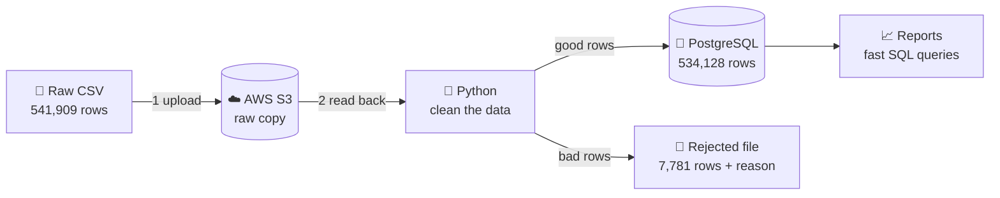
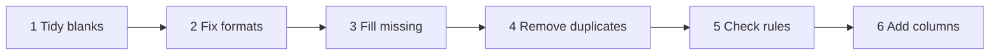
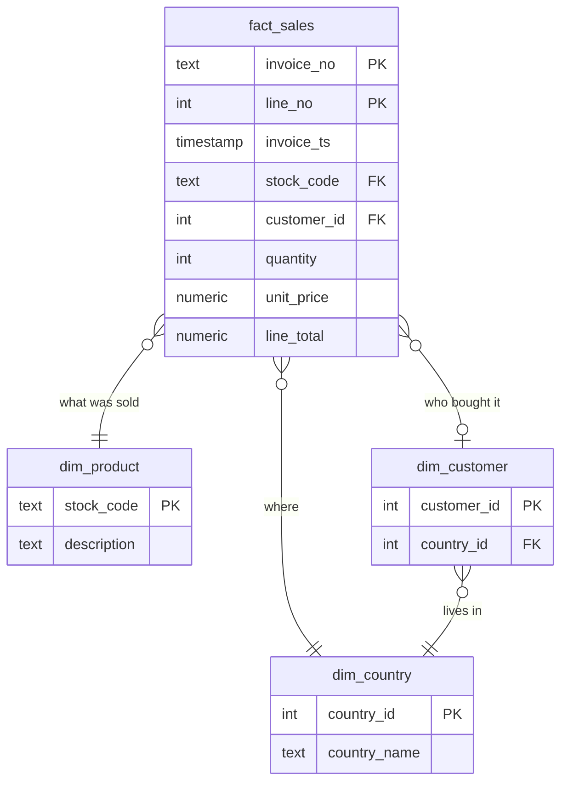
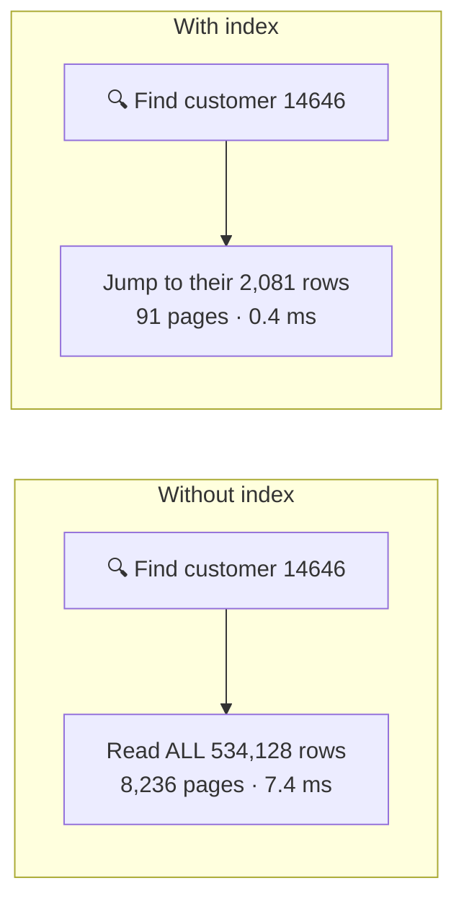
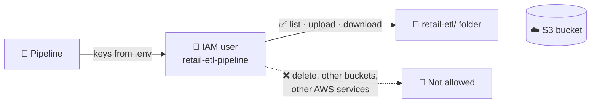

# 🛒 Retail Sales ETL Pipeline


This project takes a **real, messy sales file** (541,909 rows), stores it safely in **AWS S3**,
cleans it with **Python**, and loads it into a **PostgreSQL** database that is designed and
tuned for fast reporting.

**Everything runs with one command:**

```bash
python run_pipeline.py
```

---

## 📊 Results at a glance

| | |
|---|---|
| 📁 **Dataset** | [E-Commerce Data (Kaggle)](https://www.kaggle.com/datasets/carrie1/ecommerce-data): a UK online gift shop, Dec 2010 – Dec 2011 |
| 📏 **Size** | 541,909 rows × 8 columns (text, numbers and dates) |
| ✅ **Clean rows loaded** | 534,128 |
| ❌ **Bad rows rejected** | 7,781, each saved with the reason |
| 🔒 **Rows lost silently** | 0 (the code checks that clean + rejected = raw) |
| ⏱️ **Run time** | ~15 seconds locally, ~1.5 minutes including the S3 upload and download |

---

## 🗺️ How it works



**One run, step by step:**

1. **Upload** the raw file to S3, so the original is stored safely *before* any changes.
2. **Extract:** read the file back **from S3**.
3. **Transform:** clean it (fill gaps, fix formats, remove duplicates, check rules).
4. **Reject:** save every bad row to `data/rejected/` with the reason it failed.
5. **Load:** put the clean rows into PostgreSQL, all in one safe step.

---

## 📂 Project folders

```
sales-etl-pipeline/
├── run_pipeline.py          ▶️  the start button
├── etl/                     🐍 the pipeline code
│   ├── extract.py              read the raw file
│   ├── transform.py            clean the data
│   ├── load.py                 save to PostgreSQL
│   ├── s3_storage.py           upload / download from S3
│   ├── config.py               read settings from .env
│   └── logger.py               print progress messages
├── sql/                     🐘 database files
│   ├── 01_schema.sql           create the tables
│   ├── 02_indexes.sql          make queries fast
│   ├── 03_analytical_queries.sql   business questions
│   └── 04_materialized_views.sql   pre-calculated monthly totals
├── scripts/                 🔧 helper tools
│   ├── explore_raw_data.py     list the problems in the raw data
│   └── benchmark_queries.py    prove the indexes help (before vs after)
├── docs/                    📑 benchmark results + query plans
├── aws/iam_policy.json      🔐 AWS permissions (least privilege)
├── data/raw/                📄 raw CSV goes here (not in git)
├── data/rejected/           ❌ rejected rows are saved here (not in git)
├── requirements.txt         📦 Python libraries
└── .env.example             🔑 settings template (real .env is never committed)
```

---

## 🚀 How to run it

**You need:** Python 3.10+, PostgreSQL (e.g. [Postgres.app](https://postgresapp.com) on Mac) and a free AWS account.

```bash
# 1. Get the code and install the libraries
git clone <repo-url> && cd sales-etl-pipeline
python3 -m venv venv && source venv/bin/activate
pip install -r requirements.txt

# 2. Download data.csv from Kaggle (link above) and put it in data/raw/

# 3. Create the database
createdb retail_db

# 4. Add your settings (database user, AWS keys, bucket name)
cp .env.example .env

# 5. Run
python scripts/explore_raw_data.py   # optional: see what is wrong with the raw data
python run_pipeline.py               # full pipeline with S3
python run_pipeline.py --skip-s3     # same, but without AWS

# 6. See the results
psql retail_db -f sql/03_analytical_queries.sql
python scripts/benchmark_queries.py
```

The tables, indexes and summary view are created automatically, so you don't need to run the SQL files by hand.
To browse the tables in a window (like SSMS), connect **pgAdmin** to `localhost:5432`, database `retail_db`.

---

## 🧹 The raw data and its problems

Found with `scripts/explore_raw_data.py` **before** writing any cleaning code:

| Problem | How many | Example |
|---|---:|---|
| Missing customer ID | 135,080 | guest shoppers |
| Missing product description | 1,454 | blank cell |
| Exact duplicate rows | 5,268 | same line twice |
| Negative quantity | 10,624 | cancellations and damaged stock |
| Price of 0 or less | 2,517 | free samples, adjustments |
| Odd invoice numbers | 3 | `A563185` |
| Country written different ways | 9,052 | `EIRE`, `USA`, `RSA` |
| Mixed upper/lower case codes | 1,977 | `15056bl` vs `15056BL` |
| Dates stored as text | all rows | `"12/1/2010 8:26"` |

The file also isn't UTF-8 (it contains `£` signs in an older format), so it is read as `ISO-8859-1`.

---

## 🐍 How the cleaning works



| Step | What happens |
|---|---|
| **1. Tidy blanks** | remove extra spaces; empty cells become "missing" |
| **2. Fix formats** | text → real dates and numbers; codes in UPPERCASE; `EIRE` → Ireland, `USA` → United States |
| **3. Fill missing** | description copied from the same product code · customer ID kept empty (guest shoppers are 25% of sales, so we keep them) · country → "Unknown" |
| **4. Remove duplicates** | done *after* fixing formats, so `"abc "` and `"ABC"` are caught as the same |
| **5. Check rules** | bad rows are rejected with a named reason (table below) |
| **6. Add columns** | line number, is it a cancellation?, line total |

**Why rows were rejected:**

| Reason | Rows |
|---|---:|
| Duplicate row | 5,268 |
| Normal sale with a negative quantity (damaged / lost stock) | 1,239 |
| Price of 0 or less | 1,161 |
| Description still missing | 110 |
| Wrong invoice number format | 3 |
| **Total** | **7,781** |

Cancelled orders (invoices starting with `C`) are **kept** as negative rows, so **net revenue = simply add up all rows**.

**Loading into PostgreSQL** (`etl/load.py`):
* 🔒 **All or nothing:** every table is saved in one transaction. If anything fails, everything is undone.
* 🔁 **Safe to re-run:** it updates existing rows instead of adding duplicates (2 runs → still 534,128 rows).
* ⚡ **Fast:** uses PostgreSQL `COPY` to load 534k rows in under a second.

---

## 🐘 Database design: a star schema

One big **sales table** in the middle, with small **lookup tables** around it:



| Table | One row = | Rows |
|---|---|---:|
| `fact_sales` | one product on one invoice | 534,128 |
| `dim_product` | one product | 3,827 |
| `dim_customer` | one customer | 4,371 |
| `dim_country` | one country | 38 |

**Why this design?**
* Product and country names are stored **once**, not repeated on every sale.
* Each product gets **one** correct description (650 products had several in the raw data).
* Reports become simple joins, which is the shape BI tools like Power BI expect.

**Rules the database itself enforces** (so bad data can't get in, even if the Python code had a bug):
* 🔑 Primary key `(invoice_no, line_no)`: every sale line is unique.
* 🔗 Foreign keys: every sale must point to a real product, customer and country.
* ✔️ Checks: price > 0, quantity ≠ 0, invoice format is `123456` or `C123456`, and cancellations must have a negative quantity.

---

## ⚡ Queries and making them fast

**Business questions** (`sql/03_analytical_queries.sql`):

| # | Question |
|---|---|
| Q1 | Top 10 products by revenue in November 2011 |
| Q2 | Revenue per month and growth vs the month before |
| Q3 | Average order value by country |
| Q4 | One customer's full purchase history |
| Q5 | What % of customers came back to buy again |

> The dataset has no rating column, so *average order value by country* is used instead of the brief's *average rating by country* example.

### 📖 What is an index?

Like the index at the back of a book: instead of reading **every** row, the database **jumps straight** to the rows it needs.



**Indexes added** (`sql/02_indexes.sql`), each for a specific query:

| Index | Helps | Trick used |
|---|---|---|
| `idx_fact_sales_customer_ts` | Q4 | sorted by customer + date, so one customer's rows are found and already in order |
| `idx_fact_sales_sales_by_date` | Q1, Q3 | **partial** (only normal sales, so it is smaller) + **covering** (answers from the index alone) |

### 🏁 Before vs after (`python scripts/benchmark_queries.py`)

Each query run 5 times without, then with, the indexes:

| Query | Before | After | Result |
|---|---:|---:|---|
| Q4 customer history | 7.39 ms | **0.42 ms** | 🚀 **17.5× faster** (8,236 → 91 pages read) |
| Q3 order value by country | 32.02 ms | 17.80 ms | 1.8× faster (8× fewer pages read) |
| Q1 top products | 16.76 ms | 14.80 ms | 1.1× faster (15× fewer pages read) |
| Q2 monthly revenue | 276 ms | 270 ms | no change (expected, see below) |
| **Q2 from the summary view** | — | **0.01 ms** | 🚀 **~30,000× faster** |
| Q5 repeat customers | 95.0 ms | 92.5 ms | no change (reads every row) |

Full details: `docs/benchmark_results.md` and `docs/query_plans/`.

### 💡 Why these choices

* **Indexes help when you need a *few* rows.** Q4 is the biggest win: one customer out of 534k.
* **Fewer pages = faster on big servers.** Q1 and Q3 read 8–15× fewer pages. On a laptop the whole table fits in memory, so the time saving is small, but on a real server with more data than memory this matters a lot.
* **Indexes can't help when you need *all* rows.** Monthly revenue adds up every row, so instead it is **calculated once after each load** and saved as 13 rows (a *materialized view*, `sql/04_materialized_views.sql`).
* **Indexes have a cost** (disk space, slower inserts), so only indexes that a real query needs were added.

| Situation | Best fix |
|---|---|
| Need a **few** rows (one customer, one month) | 📖 Index |
| Need **all** rows (totals over everything) | 🧮 Materialized view (pre-calculate) |

---

## ☁️ AWS S3 and security

**What S3 does here:** the raw file is stored in S3 **before** processing, and the pipeline reads it back from S3. Each day gets its own folder, so nothing is overwritten:

```
s3://<bucket>/retail-etl/raw/ingest_date=2026-10-06/data.csv
```



**Security:**
* 🔐 **Least privilege:** a separate AWS user that can only list, upload and download files in **one folder of one bucket** (`aws/iam_policy.json`). It cannot delete anything.
* 🔑 **No passwords in code:** AWS keys are read from environment variables in `.env`. That file is in `.gitignore`, so it never reaches GitHub; `.env.example` is the empty template.
* 🛡️ The bucket blocks public access and is encrypted.

---

## 📈 Scaling, scheduling and failures

### What if there were 1 million+ rows?

| Today | At bigger scale |
|---|---|
| Whole file read into memory | read in chunks, or use Polars / DuckDB; Spark / AWS Glue for 100M+ rows |
| CSV files | Parquet files (smaller and faster) |
| Reload everything each run | only load the new day's folder (incremental loads) |
| One big sales table | split the table by month (**partitioning**), so a November query only reads November |
| Normal indexes | add BRIN indexes for dates and more summary views |
| One computer | run one task per day or month in parallel |

### ⏰ Running it every day

* **Simple:** a **cron** job runs it every night at 2 AM:
  ```cron
  0 2 * * * cd /opt/sales-etl-pipeline && ./venv/bin/python run_pipeline.py >> /var/log/retail_etl.log 2>&1
  ```
* **Production:** **Apache Airflow**, where each step becomes a task, with automatic retries, an alert on failure, and easy re-runs of past days:


### 🛟 What happens when something goes wrong

| Problem | What happens |
|---|---|
| Bad rows | not a crash: they are rejected and saved with the reason |
| Database error halfway through the load | everything is undone (one transaction), so there is never half-loaded data |
| Running again after a failure | safe: rows are updated, not duplicated |
| Network blip to S3 | automatic retries |
| Wrong AWS keys or permissions | stops immediately with a clear message |
| Any crash | full error printed and exit code 1, so cron / Airflow notice |
| Database lost | rebuild it by re-running from the raw files kept in S3 |

---

### 👩‍💻 Author
Leashaniya Krishnapillai
